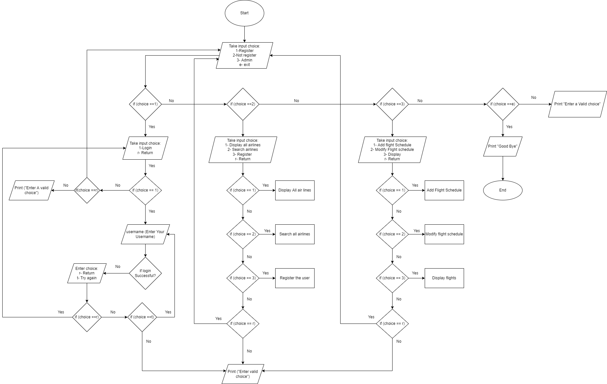

<!--
*** Thanks for checking out the Best-README-Template. If you have a suggestion
*** that would make this better, please fork the repo and create a pull request
*** or simply open an issue with the tag "enhancement".
*** Don't forget to give the project a star!
*** Thanks again! Now go create something AMAZING! :D
-->

<!-- PROJECT SHIELDS -->
<!--
*** I'm using markdown "reference style" links for readability.
*** Reference links are enclosed in brackets [ ] instead of parentheses ( ).
*** See the bottom of this document for the declaration of the reference variables
*** for contributors-url, forks-url, etc. This is an optional, concise syntax you may use.
*** https://www.markdownguide.org/basic-syntax/#reference-style-links
-->
[![Contributors][contributors-shield]][contributors-url]
[![Forks][forks-shield]][forks-url]
[![Stargazers][stars-shield]][stars-url]
[![Issues][issues-shield]][issues-url]
[![MIT License][license-shield]][license-url]
[![LinkedIn][linkedin-shield]][linkedin-url]

<!-- PROJECT LOGO -->
 

  

<h3 align="center">Project Airline</h3>

  

    project_descriptionARS stands for Airline Reservation System, and it allows an airline to sell its inventory (seats).It has schedules and rates information, as well as a database of reservations (passenger namerecords) and tickets issued.
     
    <a href="https://github.com/Yuvraj-kadale/Project_airline"><strong>Explore the docs »</strong></a>
     
     
    <a href="https://github.com/Yuvraj-kadale/Project_airline">View Demo</a>
    ·
    <a href="https://github.com/Yuvraj-kadale/Project_airline/issues">Report Bug</a>
    ·
    <a href="https://github.com/Yuvraj-kadale/Project_airline/issues">Request Feature</a>
  

<!-- ABOUT THE PROJECT -->
## About The Project

Air Malaysia group (AMG) is a luxury low-cost airline based in Malaysia. It is one of
Malaysia's fastest-growing airlines in terms of fleet size and destinations. The Air Malaysia
Group has scheduled flights to more than 100 locations in 25 countries. AMG decided to
improve their web booking by integrating their most recent flight offer, which includes airline
schedules, fare tariffs, passenger reservations, and ticket records.  

As a result, AMG asks us to design a Python programme for the ARS using suitable python
programming logic and principles, with the required features added in the programme

(<a href="#top">back to top</a>)

### Built With

* [Python](https://www.python.org/)

(<a href="#top">back to top</a>)

<!-- GETTING STARTED -->
## Features

Developed and designed the python airline booking system with the following features:  

1. A Menu screen that directs the users to Registered, Not Registered and admin portal.
2. The Registered Members can log in to the system with their usernames.
3. On successful Authentication of user the user can Display , add or modify their profile.
4. The Non Registered members can display all airline schedules, search any airlines they
want and make their account ie, get registered by creating their username.
5. The Members can search the flights with the any of the following inputs  
I. From  
II. To  
III. Date of Departure  
IV. Date of Return  
6. The admins have all the rights to add the flights, Modify the flight schedule and display
them accordingly.
7. Though, to access the admin portal they are required to add validate their username and
password.

(<a href="#top">back to top</a>)

## Flowchart

  

(<a href="#top">back to top</a>)
  

<!-- CONTRIBUTING -->
## Contributing

Contributions are what make the open source community such an amazing place to learn, inspire, and create. Any contributions you make are **greatly appreciated**.

If you have a suggestion that would make this better, please fork the repo and create a pull request. You can also simply open an issue with the tag "enhancement".
Don't forget to give the project a star! Thanks again!

1. Fork the Project
2. Create your Feature Branch (`git checkout -b feature/AmazingFeature`)
3. Commit your Changes (`git commit -m 'Add some AmazingFeature'`)
4. Push to the Branch (`git push origin feature/AmazingFeature`)
5. Open a Pull Request

(<a href="#top">back to top</a>)

<!-- LICENSE -->
## License

Distributed under the MIT License. See `LICENSE.txt` for more information.

(<a href="#top">back to top</a>)

<!-- CONTACT -->
## Contact

[Yuvraj Kadale](https://yuvraj-kadale.github.io/  )  

Project Link: [https://github.com/Yuvraj-kadale/Project_airline](https://github.com/Yuvraj-kadale/Project_airline)

(<a href="#top">back to top</a>)

<!-- MARKDOWN LINKS & IMAGES -->
<!-- https://www.markdownguide.org/basic-syntax/#reference-style-links -->
[contributors-shield]: https://img.shields.io/github/contributors/Yuvraj-kadale/Project_airline.svg?style=for-the-badge
[contributors-url]: https://github.com/Yuvraj-kadale/Project_airline/graphs/contributors
[forks-shield]: https://img.shields.io/github/forks/Yuvraj-kadale/Project_airline.svg?style=for-the-badge
[forks-url]: https://github.com/Yuvraj-kadale/Project_airline/network/members
[stars-shield]: https://img.shields.io/github/stars/Yuvraj-kadale/Project_airline.svg?style=for-the-badge
[stars-url]: https://github.com/Yuvraj-kadale/Project_airline/stargazers
[issues-shield]: https://img.shields.io/github/issues/Yuvraj-kadale/Project_airline.svg?style=for-the-badge
[issues-url]: https://github.com/Yuvraj-kadale/Project_airline/issues
[license-shield]: https://img.shields.io/github/license/Yuvraj-kadale/Project_airline.svg?style=for-the-badge
[license-url]: https://github.com/Yuvraj-kadale/Project_airline/blob/master/LICENSE.txt
[linkedin-shield]: https://img.shields.io/badge/-LinkedIn-black.svg?style=for-the-badge&logo=linkedin&colorB=555
[linkedin-url]: https://www.linkedin.com/in/yuvraj-kadale/
[product-screenshot]: images/screenshot.png
